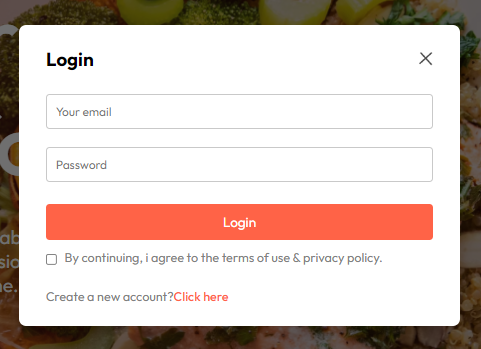
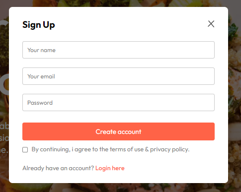
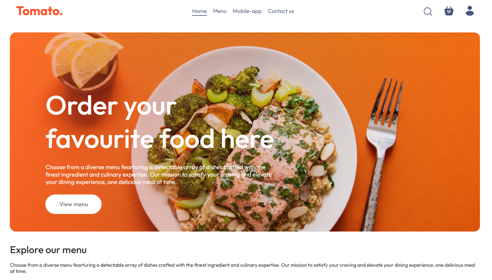
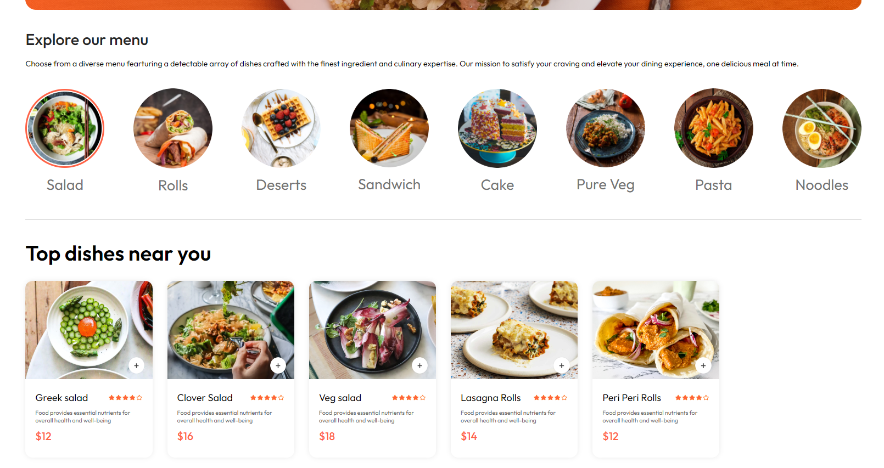
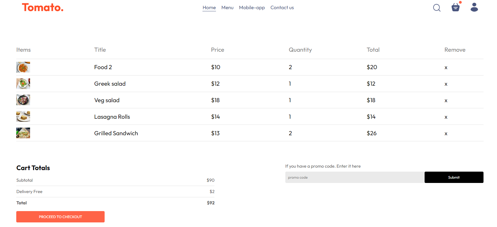
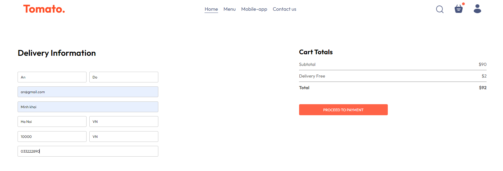
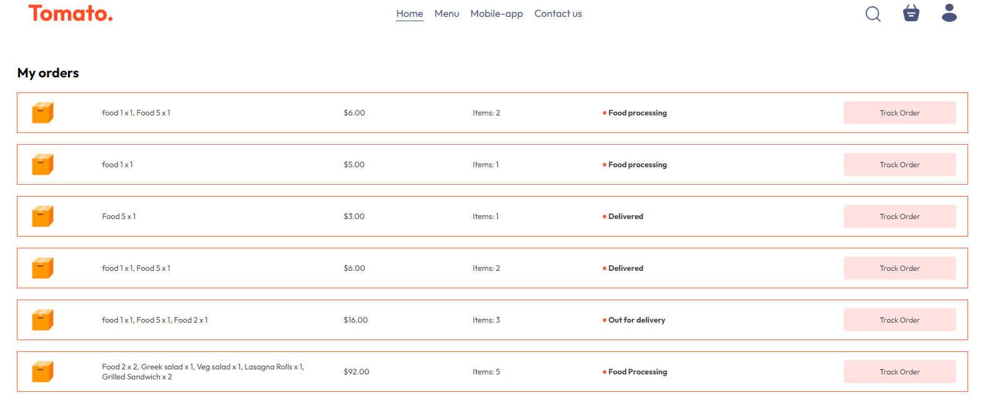
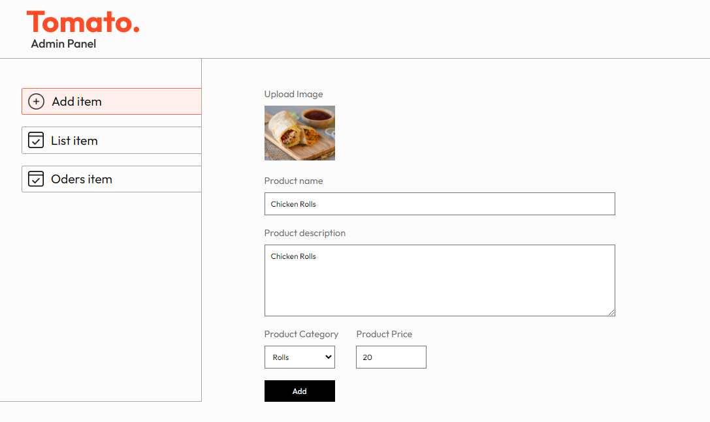
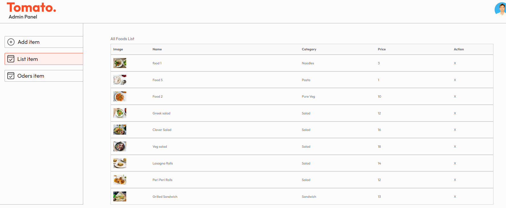
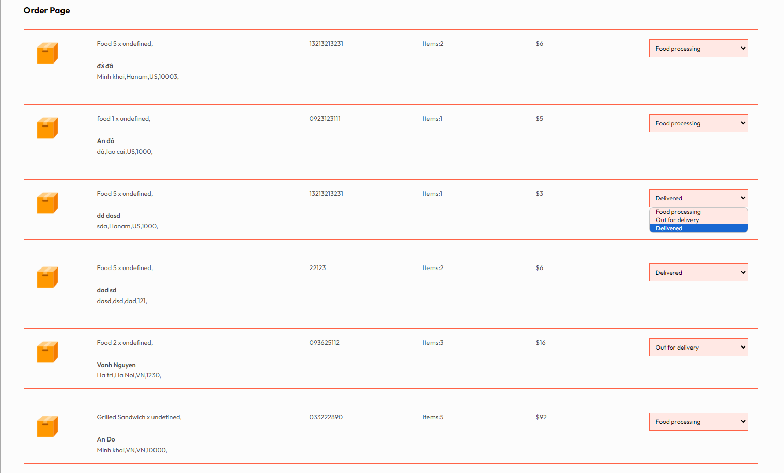

    <h1>Food Delivery Project Fullstack Basic</h1>

*Since the project has not been deployed yet, there is no website link available.*

## Introduction
The Food Delivery project is a fullstack application designed to provide an online food ordering experience for customers. The application consists of two main parts: a customer interface for placing orders and an admin dashboard for management.

## Technologies Used
- **Frontend**: ReactJS
- **Backend**: Express.js
- **Database**: MongoDB
- **Payment**: Stripe

## Features
### For Customers
- **Order Placement**: Customers can select dishes and place orders online.
- **Order Information**: Customers can track the status of their orders.
- **Payment**: Secure payment processing via Stripe.

### For Administrators
- **Menu Management**: Administrators can add, edit, and delete menu items.
- **Order Management**: Administrators can view all customer orders.

## Installation
1. Clone the repository: `git clone <repository-url>`
2. Install dependencies: 
   - Run `npm i` in both the frontend and backend directories.
3. Start the application:
   - Run the backend: `npm run dev` in the backend directory.
   - Run the frontend: `npm run dev` in the frontend directory.
   - Run the admin: `npm run dev` in the frontend directory.

## Some pictures of the project

    
    
    
    
    
    
    
    
    
    

## Conclusion
The Food Delivery project not only allows customers to easily order food but also provides administrators with effective management tools. It is an exciting project for exploring fullstack web application development.
